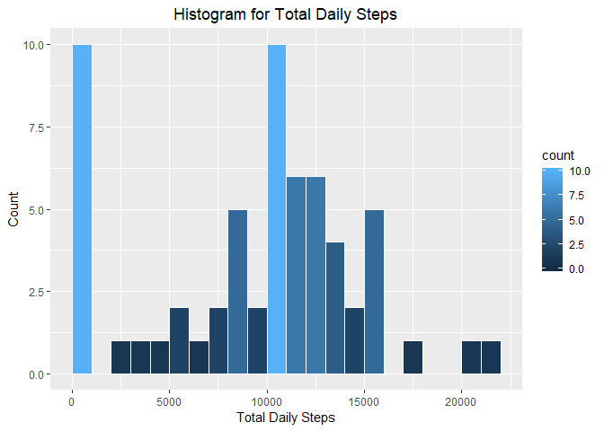
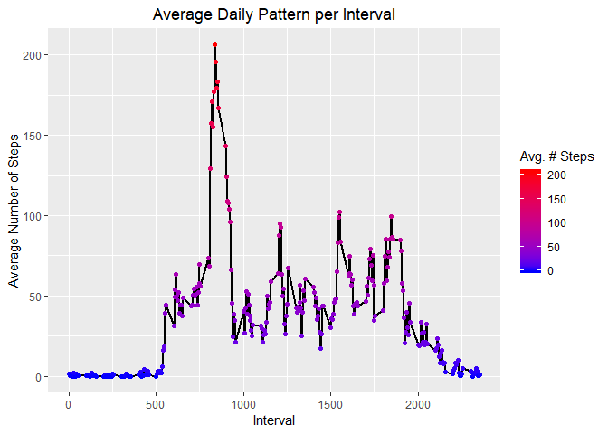
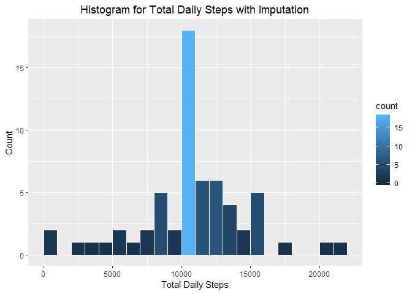
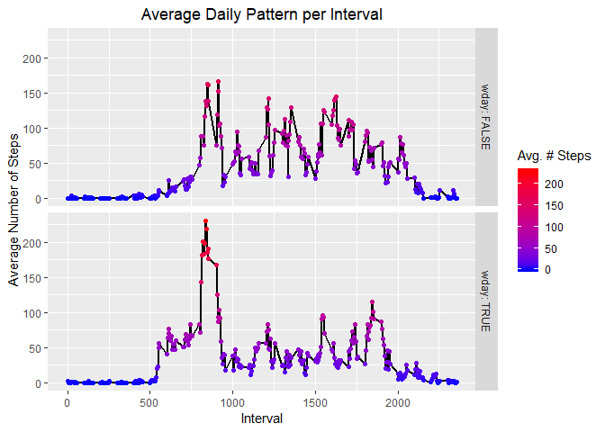

## Loading and preprocessing the data
***

### Data Description
First step will be to import the data that will be used for the analysis. As mentioned in the instructions, the data for this assignment can be downloaded from the course website [here](https://d396qusza40orc.cloudfront.net/repdata%2Fdata%2Factivity.zip). The dataset is stored in a comma-separated-value (CSV) file and there are a total of 17,568 observations in this dataset.  
  
Also, for reference, note that the variables included in this dataset are:   
- steps: Number of steps taking in a 5-minute interval (missing values are coded as **NA**)  
- date: The date on which the measurement was taken in YYYY-MM-DD format  
- interval: Identifier for the 5-minute interval in which measurement was taken  
  
Without further due, let's dive into it!  

### Download File
Using the link above, let's gather the data and note when the data was gathered.

```r
library(ggplot2)
library(timeDate)
fileUrl <- "https://d396qusza40orc.cloudfront.net/repdata%2Fdata%2Factivity.zip"
download.file(fileUrl, destfile = "activity.zip", method = "curl")
dateDownloaded <- date()
```
### Extract Data
Because the file downloaded is a .zip file, we must extract it before any manipulation is done.

```r
unzip ("activity.zip")
activity <- read.csv("activity.csv")
```
For general understanding of the data, let's do a quick check of its format and content.

```r
summary(activity)
```

```
##      steps                date          interval     
##  Min.   :  0.00   2012-10-01:  288   Min.   :   0.0  
##  1st Qu.:  0.00   2012-10-02:  288   1st Qu.: 588.8  
##  Median :  0.00   2012-10-03:  288   Median :1177.5  
##  Mean   : 37.38   2012-10-04:  288   Mean   :1177.5  
##  3rd Qu.: 12.00   2012-10-05:  288   3rd Qu.:1766.2  
##  Max.   :806.00   2012-10-06:  288   Max.   :2355.0  
##  NA's   :2304     (Other)   :15840
```

```r
str(activity)
```

```
## 'data.frame':	17568 obs. of  3 variables:
##  $ steps   : int  NA NA NA NA NA NA NA NA NA NA ...
##  $ date    : Factor w/ 61 levels "2012-10-01","2012-10-02",..: 1 1 1 1 1 1 1 1 1 1 ...
##  $ interval: int  0 5 10 15 20 25 30 35 40 45 ...
```
We notice the steps indeed have quite a few NAs (about 13% of the observations are), that the date column is currently set us as a factor variable and that interval indeed are split per 5-minute chuncks. A quick analysis using table shows that the range is [0, 2355] where, in ##XX, XX mean the minutes (hence range from 0 to 55, by jumps of 5) and ## mean the hours (hence range from 00 to 23) since midnight.  
  
To ease data manipulations, let's change the date column from a factor to an actual date format.

```r
activity$date <- as.Date(activity$date, format = "%Y-%m-%d")
class(activity$date)
```

```
## [1] "Date"
```
As for missing values, they will be handled in another section below.  

## What is mean total number of steps taken per day?
***

### Histogram of the total number of steps taken per day
One way to explore the number of steps per day would be with the help of a visual support. Also, since our data is currently at the interval granularity, we'll be working with a daily granularity table to facilitate manipulations.

```r
sumsteps <- aggregate(activity$steps, by=list(activity$date), FUN=sum, na.rm = TRUE)
names(sumsteps) <- c("date", "allsteps")
```
We have 'sumsteps' that summarized the whole dataset in taking daily sums of steps taken, and where missing values where removed to ensure smooth addition. With this data, let's make a histogram of the daily total steps.

```r
gh <- ggplot(data = sumsteps, aes(allsteps))
gh + geom_histogram(aes(fill = ..count..), col = "white", breaks = seq(0, 22000, by = 1000)) + labs(title = "Histogram for Total Daily Steps", x = "Total Daily Steps", y = "Count") + theme(plot.title = element_text(hjust = 0.5))
```

<!-- -->
  
We get a histogram with a maximum at the first inteval. Otherwise, daily number of steps are quite distributed, with 10K-11K daily steps being the most popular interval.  

### Mean and median number of steps taken each day
Let's have a more global undestanding of the data using the summary function.

```r
summary(sumsteps)
```

```
##       date               allsteps    
##  Min.   :2012-10-01   Min.   :    0  
##  1st Qu.:2012-10-16   1st Qu.: 6778  
##  Median :2012-10-31   Median :10395  
##  Mean   :2012-10-31   Mean   : 9354  
##  3rd Qu.:2012-11-15   3rd Qu.:12811  
##  Max.   :2012-11-30   Max.   :21194
```
We get quite some useful information. Not only do daily number of steps vary between 0 and 21K, but also, we get a mean of **9354** steps and a median of **10,395** steps, confirming the distribution is skewed to the left. The higher frequency of days with 0 step could be a cause of such skewness.  

## What is the average daily activity pattern?
***
### Time series plot of the average number of steps taken
This section requires to look at the data from a different perspective. Rather than looking at a daily level and summing the number of steps per interval, we'll look a the interval level, and averaging the number of steps across the same interval of different days.

```r
avesteps <- aggregate(activity$steps, by=list(activity$interval), FUN=mean, na.rm = TRUE)
names(avesteps) <- c("interval", "meansteps")
gm <- ggplot(data = avesteps, aes(interval, meansteps))
gm+geom_line(size = 1)+labs(title = "Average Daily Pattern per Interval", x = "Interval", y = "Average Number of Steps", color = "Avg. # Steps") + theme(plot.title = element_text(hjust = 0.5)) + geom_point(aes(colour = meansteps)) + scale_color_gradient(low = "blue", high = "red")
```

<!-- -->
  
We notice barely any activity until 5AM, which is expected as the subject was most likely sleeping, and a hike past 7:30AM, maybe related to a work out combined with commuting. This brings us to our next subject.  

### The 5-minute interval that, on average, contains the maximum number of steps
The time series plot showed a peak of more than 200 steps on average for a 5-minute interval that occurs at 8:35AM.

```r
subset(avesteps, meansteps == max(meansteps))
```

```
##     interval meansteps
## 104      835  206.1698
```

## Imputing missing values
***
### Strategy for imputing missing data
There are various statistically relevant options for data imputation. Given the nature of the exercise, we will use a basic imputation of using the mean of similar values. In this case, we will use the values as calculated in the table avesteps. Say, if a given date has their 6AM interval value blank, we will input the 6AM value of avesteps. Note the following:  
1. We are aware this creates a bias and reduces variation of the data. We are using this method to demonstrate the ability of creating a markdown R document rather than statistical relevant imputation applications  
2. We are not evaluating nor changing values marked as zero. They will be assumed as actual values, which can be true if the subject is sleeping or taking a shower  

```r
sum(is.na(activity$steps))
```

```
## [1] 2304
```

```r
activity$isna <- is.na(activity$steps)
activity$impsteps <- 0

for(i in 1:nrow(activity)){
    if (activity[i,4] == TRUE) {
    activity[i, 5] <- avesteps$meansteps[avesteps$interval == activity[i,3]]}
    else {activity[i, 5] <- activity[i, 1]}
}
summary(activity)
```

```
##      steps             date               interval         isna        
##  Min.   :  0.00   Min.   :2012-10-01   Min.   :   0.0   Mode :logical  
##  1st Qu.:  0.00   1st Qu.:2012-10-16   1st Qu.: 588.8   FALSE:15264    
##  Median :  0.00   Median :2012-10-31   Median :1177.5   TRUE :2304     
##  Mean   : 37.38   Mean   :2012-10-31   Mean   :1177.5                  
##  3rd Qu.: 12.00   3rd Qu.:2012-11-15   3rd Qu.:1766.2                  
##  Max.   :806.00   Max.   :2012-11-30   Max.   :2355.0                  
##  NA's   :2304                                                          
##     impsteps     
##  Min.   :  0.00  
##  1st Qu.:  0.00  
##  Median :  0.00  
##  Mean   : 37.38  
##  3rd Qu.: 27.00  
##  Max.   :806.00  
## 
```
We can now see that the impsteps column has the same range as the steps columns, without the NA's. The mean stayed relatively the same, however the 3rd quantile shifted right, rectifying the left skewness identified earlier.

### Histogram of the total number of steps taken each day after missing values are imputed
Similarly as above, we'll first create a table with data at the daily level then run a histogram with similar parameters.

```r
sumimps <- aggregate(activity$impsteps, by=list(activity$date), FUN=sum)
names(sumimps) <- c("date", "allimps")

gi <- ggplot(data = sumimps, aes(allimps))
gi + geom_histogram(aes(fill = ..count..), col = "white", breaks = seq(0, 22000, by = 1000)) + labs(title = "Histogram for Total Daily Steps with Imputation", x = "Total Daily Steps", y = "Count") + theme(plot.title = element_text(hjust = 0.5))
```

<!-- -->
  
We notice that there is a significant smaller number of occurences of days with 0 to 1000 steps, and a major increase of the already popular 10K-11K steps interval. This makes sense as values were imputed at the interval level for their respective means. This summarized data may mean that usually, NA's occur at the day level rather than one-offs.


## Are there differences in activity patterns between weekdays and weekends?
***
### Panel plot comparing the average number of steps taken per 5-minute interval across weekdays and weekends
The first step is to identify weekdays vs weekends in our data. Then, we'll aggregate data at the interval level, similarly as above, while considering whether or not the data belongs to a weekday.

```r
activity$wday <- isWeekday(activity$date)
aveday <- aggregate(cbind(impsteps) ~ interval + wday, data = activity, FUN = mean)
gw <- ggplot(data = aveday, aes(interval, impsteps))
gw + geom_line(size = 1)+labs(title = "Average Daily Pattern per Interval", x = "Interval", y = "Average Number of Steps", color = "Avg. # Steps") + theme(plot.title = element_text(hjust = 0.5)) + geom_point(aes(colour = impsteps)) + scale_color_gradient(low = "blue", high = "red") + facet_grid(rows = vars(wday), labeller = label_both)
```

<!-- -->
  
We notice a higher peak on the weekday mornings (wday: TRUE), followed by lesser steps throughout the rest of the day, while weekends have a smoother distribution but steps start a bit later than on weekdays.
